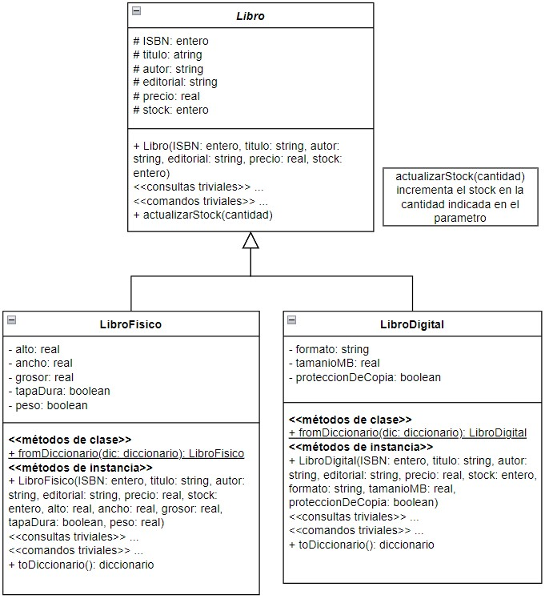

# Segundo parcial - Tema 3

## API de libros para la Taberna de Moe

Moe desea implementar en su taberna un sector dedicado a los hijos de sus clientes, y a pedido de Lisa incorporará material de lectura tanto en formato físico como digital.
Para ello, Moe necesita una API que le permita gestionar los libros.
Los libros tienen un ISBN que los identifica, un título, el autor, la editorial, un precio y una cantidad en stock. 
Los libros físicos también poseen datos sobre sus dimensiones: alto, ancho y grosor, si posee tapa dura o no, y su peso. En cambio, los libros digitales mantienen información del formato del libro, su tamaño en MB y si poseen protección de copia o no.
Los libros están modelados de la siguiente manera:

Moe comenzó a desarrollar la API pero no la terminó. Completá lo que falta para ofrecer operaciones CRUD sobre el recurso "Libros" y corregí los errores que cometió Moe. Donde corrijas un error agregá un comentario indicando el error corregido.